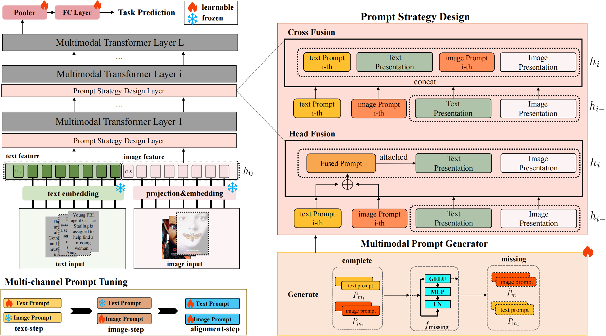

# RobustPT : Dynamic Disentanglement Prompt Tuning in Vision-Language Models with Missing Modalities
Code for [RobustPT : Dynamic Disentanglement Prompt Tuning in Vision-Language Models with Missing Modalities]()

## Introduction
Recently, prompt tuning has garnered considerable attention due to its success across various Vision-Language (VL) tasks. However, unimodal prompts, coupled prompts, and joint prompts in these models often lead to suboptimal performance due to differences in information density and complexity between modalities. Particularly, in scenarios with missing modalities, these prompt-based approaches tend to exacerbate ‘Channel Bias’-a phonomenon where models overly rely on specific feature (such as unmissing-modal feature) channels from the base tasks, thereby undermining the model's ability to capture crucial shared knowledge applicable to new tasks and affecting its generalizability. To address this challenge, we propose **RobustPT**, a dynamic disentanglement prompt tuning model designed to enhance the robustness of VL models under modality missing conditions. RobustPT utilizes a multi-channel prompting mechanism to dynamically disentangle and align prompts. Specifically, RobustPT is divided into single-channel tuning and alignment-channel tuning, where prompts for each modality run independently in sequence to delve deeply into their intrinsic characteristics, followed by an integration through a non-strong coupling strategy to effectively balance information contributions and enhance overall performance. Extensive experiments demonstrate that our RobustPT achieve significant improvements over the current state-of-the-art across all benchmark datasets.

<div align="center">
  
</div>


## Use of the Code
Note, this preparation is mainly dependent on the work of [MPVR](https://github.com/YiLunLee/missing_aware_prompts). 
### Enviroment
#### Prerequisites
To begin, create a virtual environment for the project. Name this environment `muap` and ensure that the `Python` version installed within it is 3.8 (more stable). 
```
conda create -n muap python=3.8
```
Then, we need to supplement the library PyTorch=1.10.0, which requires CUDA=11.3.
```
pip install torch==1.11.0+cu113 torchvision==0.12.0+cu113 torchaudio==0.11.0 --extra-index-url https://download.pytorch.org/whl/cu113
```
Please try installing the additional libraries by running the command below.
```
pip install -r requirements.txt
```

### About Dataset


For our experiments, we utilized three vision-language datasets: [MM-IMDb](https://github.com/johnarevalo/gmu-mmimdb), [UPMC Food-101](https://visiir.isir.upmc.fr/explore), and [Hateful Memes](https://ai.facebook.com/blog/hateful-memes-challenge-and-data-set/). We employed the `pyarrow` library to serialize the data, and the corresponding conversion scripts can be found in the `vilt/utils/write_*.py` files within our repository. To ensure compatibility, we request that you organize your datasets as outlined in [Data.md](https://github.com/YiLunLee/missing_aware_prompts/blob/main/DATA.md). Deviations from this structure may require adjustments to the `write_*.py` files to match your specific dataset paths and files. The following script can be executed to generate the `pyarrow` binary file:
```
python make_arrow.py --dataset [DATASET] --root [YOUR_DATASET_ROOT]
```
### Preperation for Training

1. In order to get the pre-trained backbone，you can download the pre-trained ViLT model weights from [here](https://github.com/dandelin/ViLT.git).
or directly using:
```
wget https://github.com/dandelin/ViLT/releases/download/200k/vilt_200k_mlm_itm.ckpt
```
2. Then start to train your model.
```
python run.py with data_root=<ARROW_ROOT> \
        num_gpus=<NUM_GPUS> \
        num_nodes=<NUM_NODES> \
        per_gpu_batchsize=<BS_FITS_YOUR_GPU> \
        <task_finetune_mmimdb or task_finetune_food101 or task_finetune_hatememes> \
        load_path=<PRETRAINED_MODEL_PATH> \
        exp_name=<EXP_NAME>
```

### Evaluation
Evaluation uses almost the same command but replace the `load_path` with your saved path during training and set  `test_only=True`
```
python run.py with data_root=<ARROW_ROOT> \
        num_gpus=<NUM_GPUS> \
        num_nodes=<NUM_NODES> \
        per_gpu_batchsize=<BS_FITS_YOUR_GPU> \
        <task_finetune_mmimdb or task_finetune_food101 or task_finetune_hatememes> \
        load_path=<MODEL_PATH> \
        exp_name=<EXP_NAME> \
        prompt_type=<PROMPT_TYPE> \
        test_ratio=<TEST_RATIO> \
        test_type=<TEST_TYPE> \
        test_only=True     
```


## Acknowledgements
This code is based on [MPVR](https://github.com/YiLunLee/missing_aware_prompts) and [ViLT](https://github.com/dandelin/ViLT.git).
